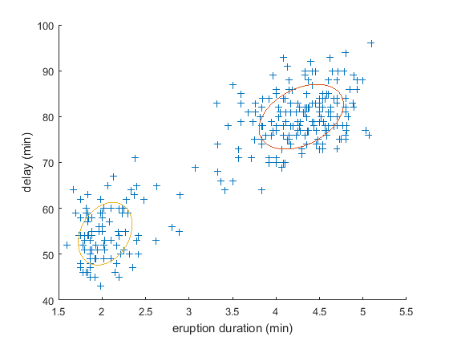

FastEM for Matlab
=================

FastEM is an efficient implementation of the expectation maximization (EM) algorithm in MATLAB. The EM algorithm can be used for clustering data and approximation with Gaussian mixture densities.

Requirements
------------

  * a reasonably recent version of MATLAB
  * a C++ Compiler (tested with Visual Studio 2015)
  * [Nonlinear Estimation Toolbox](https://bitbucket.org/nonlinearestimation/toolbox/)

Features
--------

  * supports weighted samples (most public implementations do not!)
  * kmeans++ initialization
  * fast performance, can make use of OpenMP, SSE, AVX using Eigen
  * avoids overflows and underflows by use of logarithmic representation
  * avoids degeneration of covariance by use of regularization

Example usage
-------------
First, compile the mex file by adding the Nonlinear Estimation Toolbox to the MATLAB path and then calling

	>> compile

Then, you can run FastEM using

	>> [mus, Cs, ws] = fastem(samples, weights, n);

Here, samples is a matrix where each column represents a sample, weights is a row vector summing to one, where each entry is the weight of a sample and n is the number of Gaussian components to fit. 
The return values are a matrix containing all mean vectors, a tensor containing all covariance matrices and a row vector containing the weights of each Gaussian component.

For further information, take a look at the included demos, which can be run using

	>> demo1
	>> demo2
	>> demo3

License
-------

FastEM is licensed under the GPLv3 license.

Contact
-------

Author: Gerhard Kurz

Mail: kurz.gerhard (at) gmail (dot) com

Web: [http://www.gerhardkurz.de](http://www.gerhardkurz.de)

